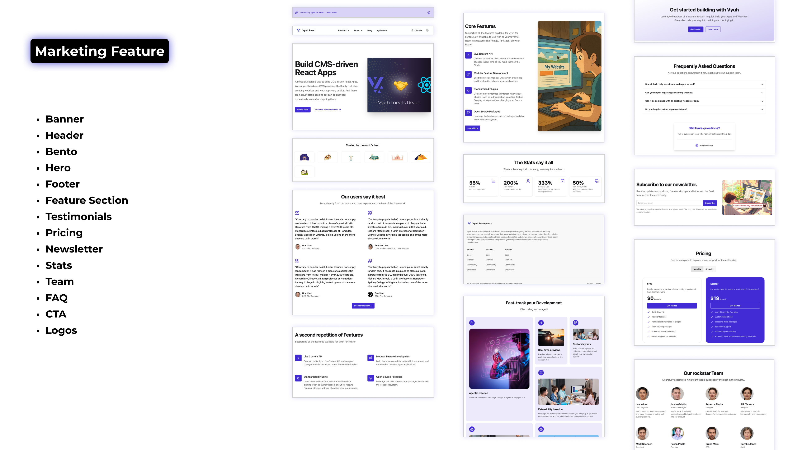
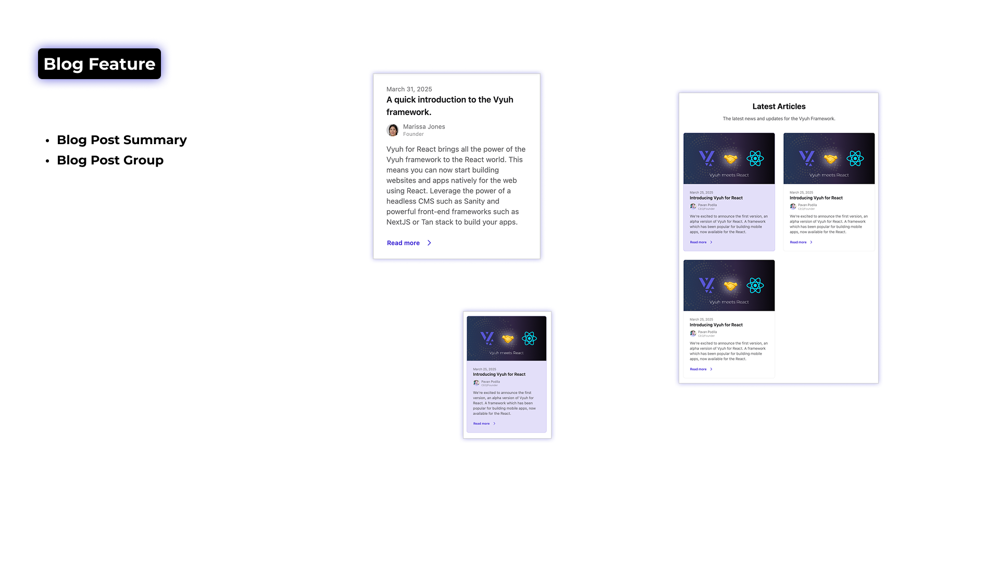

<p align="center">
  <a href="https://vyuh.tech">
    
  </a>
  <h1 align="center">Vyuh for React</h1>
  <p align="center">Build Modular, Scalable, CMS-driven React Applications</p>
  <h4 align="center">
    <a href="https://docs.vyuh.tech/react">Docs</a> |
    <a href="https://vyuh.tech">Website</a>
  </h4>
</p>

<!-- ALL-CONTRIBUTORS-BADGE:START - Do not remove or modify this section -->

[](#contributors-)

<!-- ALL-CONTRIBUTORS-BADGE:END -->

[](https://discord.gg/b49sbjqszG)

## Core Packages

| Package                                                                                                                                                                                                                                                                                                   | Description                          |
| --------------------------------------------------------------------------------------------------------------------------------------------------------------------------------------------------------------------------------------------------------------------------------------------------------- | ------------------------------------ |
| [](https://www.npmjs.com/package/@vyuh/react-core)                                                                                                         | Core platform and architecture       |
| [](https://www.npmjs.com/package/@vyuh/react-extension-content)                                                     | Content management system            |
| [](https://www.npmjs.com/package/@vyuh/react-feature-system)                                                                 | System-level features and components |
| [](https://www.npmjs.com/package/@vyuh/react-plugin-content-provider-sanity) | Sanity.io content provider           |

## Hi there! 👋

**Vyuh for React** brings the powerful architecture of the Vyuh Flutter
framework to the React ecosystem. It provides a comprehensive solution for
building CMS-driven React applications with a focus on modularity, scalability,
and developer experience.

Building on the success of Vyuh for Flutter, this React implementation gives
**no-code** flexibility to Business teams (via the CMS), and the **full-code**
power to Engineering teams. This puts the right control at the right place
without any compromise.

## 🤔 Why did we build this?

A common problem when building large scale applications is the _need to stay
modular_ as you keep growing the feature set. You also want different teams to
_work in parallel_ without stepping on each other. The typical approach of
creating a single project and building all the functionality in it does not
scale very well over time.

Additionally, modern web applications are very content-oriented and need to be
dynamic. This means your journeys, page content, themes, etc. should be remotely
controllable. In other words, making your app _Server-driven_.

### Separation of Concerns

Combining all these capabilities requires a holistic approach, which is only
possible when you build a cohesive framework.

> **Vyuh** is that framework.
>
> It allows you to create the perfect balance of simple, modular components on
> the `CMS`, with powerful `React` counterparts that take care of all the
> complexity.

The teams (Business teams) managing the content and experience don't have to
worry about UI Design, pixel precision or performance and focus more on
_building the screen journeys and page content_ instead. The React engineering
teams handle the complexity of the components along with its performance.

This clear separation allows a phenomenal flexibility in building simple to
large scale apps. It also gives _the right tools to the right teams_ and makes
them more productive.

## The Framework

The **Vyuh for React** framework has some powerful built-in capabilities such
as:

- [x] Building features atomically and in a modular fashion
- [x] Features as transferable and reusable units of functionality
- [x] Remote configuration of content, enabling Server-Driven UI
- [x] Extensible Plugin-based approach to add new third-party integrations
- [x] Team Independence
- [x] Decentralised development
- [x] Creating a family of apps with reusable features
- [x] A growing set of integrations to make app development faster

## 🔩 The Building Blocks

The core building blocks that enable all of this include:

- **Features**: Build user-facing functionality in a modular, reusable, atomic
  manner. Features can be composed together to create the entire app or a family
  of apps.

- **Plugins**: All third party integrations are handled in a cross-cutting
  manner using Plugins. Authentication, Networking, CMS, Storage, Permissions,
  etc. are all plugins that are available to all features.

- **CMS-Driven UI**: Also known as Server-Driven UI, the entire app experience
  can be driven from a CMS. This includes the screen journeys, page content,
  themes, etc. The CMS itself is a standard plugin with custom Providers.

> [!NOTE]
>
> The default CMS we use is [Sanity.io](https://sanity.io).

## Getting Started 🚀

### Basic Setup

```tsx
import { VyuhProvider, PluginDescriptor } from '@vyuh/react-core';
import { DefaultContentPlugin } from '@vyuh/react-extension-content';
import { SanityContentProvider } from '@vyuh/react-plugin-content-provider-sanity';
import { feature as systemFeature } from '@vyuh/react-feature-system';

// Configure your content provider
const contentProvider = new SanityContentProvider({
  projectId: 'your-project-id',
  dataset: 'production',
  perspective: 'published',
  useCdn: true,
});

// Configure plugins
const plugins = new PluginDescriptor({
  content: new DefaultContentPlugin(contentProvider),
});

// Define your features
const getFeatures = () => [
  systemFeature,
  // Your custom features
];

// Set up your application
function App() {
  return (
    <VyuhProvider features={getFeatures} plugins={plugins}>
      <YourApp />
    </VyuhProvider>
  );
}
```

### Using the Vyuh Hook

```tsx
import { useVyuh } from '@vyuh/react-core';

function MyComponent() {
  const { features, plugins } = useVyuh();

  // Access content plugin
  const contentPlugin = plugins.content;

  // Render content
  return (
    <div>
      {contentPlugin.render({
        _type: 'myContentType',
        title: 'Hello World',
        // ...other content properties
      })}
    </div>
  );
}
```

## Example Features

The Vyuh React framework includes modular features that demonstrate different
content patterns and use cases. Here's an overview of two key features:

### [Marketing Feature](./packages/react-feature-marketing)



The Marketing feature (`@vyuh/react-feature-marketing`) provides components for
building marketing pages:

- **Feature Sections**: Display product features with different layouts:
  - `simple` variant: Text-based feature lists with icons
  - `with-media` variant: Features with accompanying media (images, videos, code
    examples)
- **Banner Sections**: Announcement components with customizable content
- **Bento Grid Layouts**: Flexible grid components for visual content
  organization
- **CTA Sections**: Call-to-action components with configurable buttons
- **FAQ Sections**: Expandable question and answer components
- **Header & Footer**: Navigation and site information components
- **Hero Sections**: Page introduction components with various layouts
- **Logo Sections**: Brand showcase components
- **Newsletter Sections**: Email signup components
- **Pricing Sections**: Product/service pricing displays
- **Stats Sections**: Numerical data visualization components
- **Team Sections**: Team member profile components
- **Testimonials Sections**: Customer quote components

Each component is implemented as a content builder that can be rendered through
the content plugin system.

### [Blog Feature](./packages/react-feature-blog)

The Blog feature (`@vyuh/react-feature-blog`) offers components for content
publishing:



- **Blog Group**: Collections of blog posts with customizable layouts
- **Blog Post Summary**: Preview components for individual blog posts

### Reference Implementation Patterns

These features serve as reference implementations that demonstrate scalable
patterns for building your own features:

1. **Content Type Definition**: How to structure and validate content schemas
2. **Component Layouts**: Implementing multiple layouts for the same content
   type
3. **Content Descriptors**: Extending and customizing content descriptors for a
   type
4. **Content Builders**: Connecting components to the content system
5. **Feature Composition**: Organizing related components into cohesive features
6. **Plugin Integration**: Leveraging core plugins for authentication, routing,
   etc.
7. **Conditional Rendering**: Displaying content based on user state or other
   conditions
8. **Content Relationships**: Managing references between different content
   types

The patterns demonstrated in these features can be applied to build more complex
features like e-commerce systems, user dashboards, or interactive applications.
They provide a foundation that scales from simple content display to
sophisticated, data-driven experiences.

By studying these reference implementations, developers can understand how to
structure their own features in a way that maintains separation of concerns
while enabling business teams to control content through the CMS.

## Contact

Follow us, stay up to date or reach out on:

- [@vyuh_tech](https://x.com/vyuh_tech)
- [LinkedIn](https://www.linkedin.com/company/vyuh-tech)
- [Discord](https://discord.gg/b49sbjqszG)
- [Email](mailto:ask@vyuh.tech)

## Contributors ✨

Thanks goes to these wonderful people
([emoji key](https://allcontributors.org/docs/en/emoji-key)):

<!-- ALL-CONTRIBUTORS-LIST:START - Do not remove or modify this section -->
<!-- prettier-ignore-start -->
<!-- markdownlint-disable -->
<table>
  <tbody>
    <tr>
      <td align="center" valign="top" width="14.28%"><a href="https://vyuh.tech/"><br /><sub><b>Pavan Podila</b></sub></a><br /><a href="https://github.com/vyuh-tech/vyuh-react/commits?author=pavanpodila" title="Code">💻</a> <a href="https://github.com/vyuh-tech/vyuh-react/commits?author=pavanpodila" title="Documentation">📖</a> <a href="https://github.com/vyuh-tech/vyuh-react/commits?author=pavanpodila" title="Tests">⚠️</a></td>
      <td align="center" valign="top" width="14.28%"><a href="https://navneetnagpal.wordpress.com/"><br /><sub><b>Navneet Nagpal</b></sub></a><br /><a href="https://github.com/vyuh-tech/vyuh-react/issues?q=author%3Anavneetnagpal" title="Bug reports">🐛</a></td>
    </tr>
  </tbody>
</table>

<!-- markdownlint-restore -->
<!-- prettier-ignore-end -->

<!-- ALL-CONTRIBUTORS-LIST:END -->

This project follows the
[all-contributors](https://github.com/all-contributors/all-contributors)
specification. Contributions of any kind welcome!

## Want to Contribute? 🤗

We welcome contributions from the community! Please check out our
[CONTRIBUTING.md](CONTRIBUTING.md) for detailed guidelines on how to contribute
to the Vyuh Framework.

---

<p align="center">Made with ❤️ by <a href="https://vyuh.tech">Vyuh</a></p>
